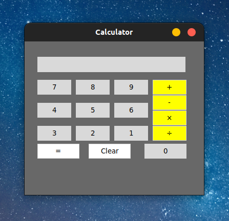

<h1 align="center">🔢 Calculator 🔢</h1>

A simple calculator I got as a task to make by [Tkinter](https://docs.python.org/3/library/tkinter.html) 🚁

---

## ℹ️ Overview:-
Simple design.  

Have a look:-  
  
That is enough? 🙃

---

<h6 align="center">Made with ❤️ in Cairo, Egypt 🇪🇬</h6>